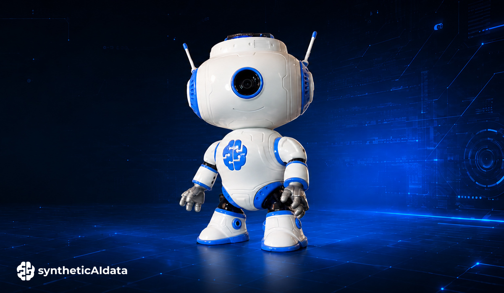

# JBR-001 - A Desktop Companion Robot Powered by Arduino® UNO™ Q

JBR-001 is an open-source, 3D-printable desktop companion robot powered by the **Arduino® UNO™ Q**.

We designed JBR-001 as a small platform for experimenting with robotics, physical interaction, edge AI, and computer vision. It combines a camera, distance sensing, sound, an animated display, and three servo motors in a compact robot that you can print, assemble, program, and extend yourself.

The robot can greet you by moving its arms and head, play sounds, animate its display, sense nearby objects using a distance sensor, and use its camera for computer vision applications running on the Arduino UNO Q.

You can build your own JBR-001 using the open-source code, 3D-printable files, step-by-step assembly instructions and a synthetic dataset for training its computer vision model, all available on Arduino Project Hub.

JBR-001 was built by **[syntheticAIdata](https://syntheticaidata.com)** in partnership with **Arduino®**.

Qualcomm branded products are products of Qualcomm Technologies, Inc. and/or its subsidiaries. Arduino, UNO, and Modulino are trademarks or registered trademarks of Arduino S.r.l.